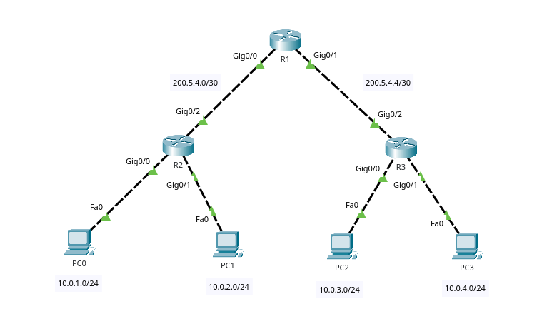

# ACL (Access Control List)



Wildcard masks are used instead of subnet masks.

ACL can filter inbound or outbound traffic on an interface.

Every ACL has an implicit `deny any` at the end (blocks everything that is not permitted earlier)

Keywords:

- `permit` - permit packets that match this ALC
- `deny` - drop packets that match this ACL
- `remark` - a comment describing this ACL

## Standard

Can only filter based on source IP address.
Usually placed as close to the destination as possible.

### Standard numbered

numbers 1-99, 1300-1999

Example: Only allow traffic from `10.0.1.0/24` (`PC0`) to access network `10.0.3.0/24` (`PC2`).
Since we're using standard ACL we can only filter based on source IP, so we need to place it as close to the destination network as possible.

1. Create the ALC

    ```txt
    R2(config)# access-list 1 permit 10.0.1.0 0.0.0.255
    R2(config)# access-list 1 deny any <-- Implicit deny any, already exists
    ```

2. Place it on an interface (outbound on `R2` interface `g0/1`).

    ```txt
    R2(config)# interface g0/1
    R2(config)# ip access-group 1 out
    ```

### Standard named

Example: Only allow traffic from `10.0.1.0/24` (`PC0`) to access network `10.0.3.0/24` (`PC2`).
Since we're using standard ACL we can only filter based on source IP, so we need to place it as close to the destination network as possible.

1. Create the ALC

    ```txt
    R2(config)# ip access-list standard ALLOW_ONLY_PC0
    R2(config-std-nacl)# permit 10.0.1.0 0.0.0.255
    R2(config-std-nacl)# deny any        <-- Implicit deny any, already exists
    ```

2. Place it on an interface (outbound on `R2` interface `g0/1`).

    ```txt
    R2(config)# interface g0/1
    R2(config)# ip access-group ALLOW_ONLY_PC0 out
    ```

## Extended

Can filter based on source/destination IP address, TCP/UDP port, ...
Usually places as close to the source as possible (more efficient)

### Extended numbered

numbers 100-199, 2000-1699

Example: Clients from network `10.0.1.0/24` are not permitted to telnet to `10.0.4.0/24` (everything else is permitted).

1. Create the ALC

    ```txt
    R2(config)# access-list 100 deny tcp 10.0.1.0 0.0.0.255 10.0.4.0 0.0.0.255 eq telnet
    R2(config)# access-list 100 permit any any <-- Avoid blocking everything with the implicit deny any
    ```

2. Place it on an interface (inbound on `R2` interface `g0/0`).

    ```txt
    R2(config)# interface g0/0
    R2(config)# ip access-group 1 in
    ```

### Extended named

Example: Clients from network `10.0.1.0/24` are not permitted to telnet to `10.0.4.0/24` (everything else is permitted).

1. Create the ALC

    ```txt
    R2(config)# ip access-list extended BLOCK_TELNET
    ! deny <protocol> <src-ip> <src-mask> <dest-ip> <dest-mask> eq <port>
    R2(config-ext-nacl)# deny tcp 10.0.1.0 0.0.0.255 10.0.4.0 0.0.0.255 eq telnet
    R2(config-ext-nacl)# permit any any     <-- Avoid blocking everything with the implicit deny any
    ```

2. Place it on an interface (inbound on `R2` interface `g0/0`).

    ```txt
    R2(config)# interface g0/0
    R2(config)# ip access-group BLOCK_TELNET in
    ```
