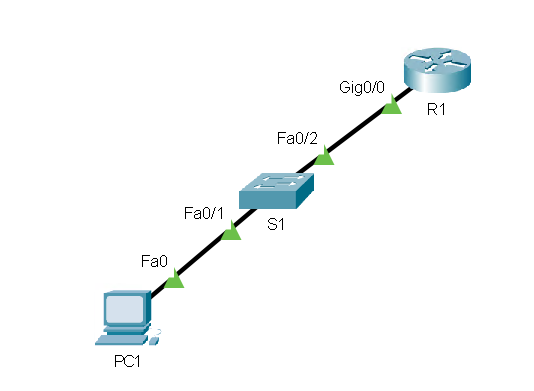

# Access protection

In the following examples I'll use `cisco123` as the password.
You should use something stronger.

## Securing privileged exec mode

```txt
Router(config)# enable secret cisco123
```

## Securing user exec (console ports)

```txt
# Without this the password will be visible in plain text
Router(config)# service password-encryption 

Router(config)# line console 0
Router(config-line)# password cisco123   
Router(config-line)# login
```

## SSH

On the following network we would like to be able to use SSH to connect to both `S1` and `R1`.
The configuration will be the same, except that on the switch you also need to assign it an IP address via an SVI (VLAN) interface.



```txt
# Make sure the device has a hostname set (anything but the default)
Switch(config)# hostname S1

# You need to set a domain
S1(config)# ip domain-name example.net

S1(config)# ip ssh version 2

# Creating an SVI (skip if configuring a router)
S1(config)# vlan 99
S1(config-vlan)# name Management
S1(config)# interface vlan 1    # On a production system use a separate management VLAN
S1(config)# ip address 192.168.99.10 255.255.255.0  # The switch needs an IP address

# Asks for a key size (a power of 2), more is safer but also slower (2048 or 4096 are fine)
S1(config)# crypto key generate rsa 

# This selects interfaces 0 to 3, if you have more you might need to use 0 15 or something similar
S1(config)# line vty 0 3    
S1(config-line)# transport input ssh
S1(config-line)# login local        # Do not skip this step

# Username and password for logging in via SSH
S1(config)# username joe secret cisco123

# You should also set a password for privileged exec mode (see above)
```
