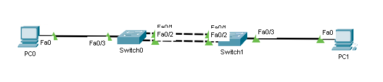

# EtherChannel



Make sure all links are the same.

## Configure LACP

This is an open standard.
You should use this.

Both sides are configured identically

```txt
Switch0(config)# interface range fa0/1-2
Switch0(config-range-if)# channel-group 1 mode active
```

```txt
Switch1(config)# interface range fa0/1-2
Switch1(config-range-if)# channel-group 1 mode active
```

## Configue PAgP

This is Cisco proprietary.
You should probably use LACP

Both sides are configured identically

```txt
Switch0(config)# interface range fa0/1-2
Switch0(config-range-if)# channel-group 1 mode desirable
```

```txt
Switch1(config)# interface range fa0/1-2
Switch1(config-range-if)# channel-group 1 mode desirable
```

## Manually set EtherChannel (not recommended)

You could also skip the negotiations and manually create an EtherChannel,
but that is not recommended because you lose the ability to detect disconnected cables.

Both sides are configured identically

```txt
Switch0(config)# interface range fa0/1-2
Switch0(config-range-if)# channel-group 1 mode on
```

```txt
Switch1(config)# interface range fa0/1-2
Switch1(config-range-if)# channel-group 1 mode on
```

## Verify EtherChannel

Here are some useful commands for verifying EtherChannels

```txt
S# show etherchannel summary
S# show etherchannel port-channel
```

## Additional configuration on the interface

EtherChannel creates a virtual interface on top of the physical interfaces, which means that you can use the new interface to for VLANs and other configuration.

```txt
S(config)# interface range fa0/1-2
S(config-if-range)# channel-group 1 mode active
S(config-if-range)# exit

S(config)# interface port-channel 1
S(config-if)# switchport mode trunk
S(config-if)# switchport trunk allowed vlan 1,2,20 
```
