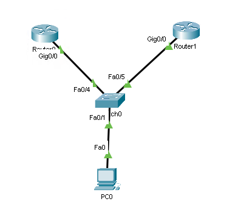

# First Hop Redundancy Protocols



We want `Router0` (left) to be the active router and `Router1` to be the standby router.

Don't forget to first set the IP address of the interface.

## HSRP

- cisco proprietary

```txt
Router0(config)# interface g0/0
Router0(config-if)# standby 1 ip 192.168.1.1
Router0(config-if)# standby 1 priority 110      # 110 > 100 -> active
Router0(config-if)# standby 1 preempt
```

```txt
Router1(config)# interface g0/0
Router1(config-if)# standby 1 ip 192.168.1.1
Router1(config-if)# standby 1 priority 100      # 100 < 110 -> standby    
Router1(config-if)# standby 1 preempt
```

## VRRP

- open standard

```txt
Router0(config)# interface g0/0
Router0(config-if)# vrrp 1 ip 192.168.1.1
Router0(config-if)# vrrp 1 priority 110         # 110 > 100 -> active
Router0(config-if)# vrrp 1 preempt
```

```txt
Router1(config)# interface g0/0
Router1(config-if)# vrrp 1 ip 192.168.1.1
Router1(config-if)# vrrp 1 priority 100         # 100 < 110 -> standby
Router1(config-if)# vrrp 1 preempt
```
