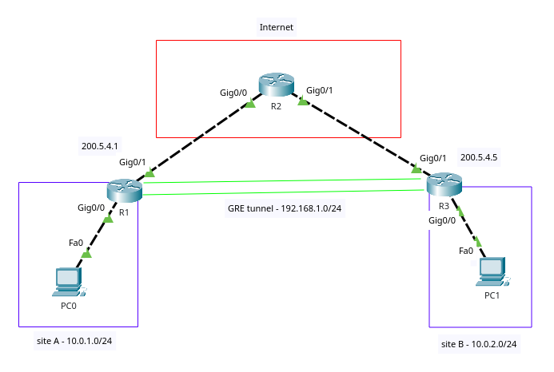

# GRE (Generic Routing Encapsulation)

- does **not** provide encryption



We would like to create a GRE tunnel between `Site A` and `Sit e B`.

## GRE

Configuration is symmetrical on both routers.
We need to configure an IP address for the virtual interface and specify a tunnel source and a tunnel destination.

```txt
R1(config)# interface Tunnel0
R1(config-if)# ip address 192.168.1.1 255.255.255.0
R1(config-if)# tunnel source gig0/1
R1(config-if)# tunnel destination 200.5.4.5
```

```txt
R3(config)# interface Tunnel0
R3(config-if)# ip address 192.168.1.2 255.255.255.0
R3(config-if)# tunnel source gig0/1
R3(config-if)# tunnel destination 200.5.4.1
```

## Routing

In order to make the above example work we also need to configure routing.
For example we could configure a default static route on `R1` and `R3` pointing towards `R2` and two additional static routes on `R2`

```txt
R1(config)# ip route 0.0.0.0 0.0.0.0 g0/1

R3(config)# ip route 0.0.0.0 0.0.0.0 g0/1

R2(config)# ip route 10.0.1.0 255.255.255.0 g0/0
R2(config)# ip route 10.0.2.0 255.255.255.0 g0/1
```

For routing between internal networks (`10.0.1.0/24`, `10.0.2.0/24` and `192.168.1.0/24`) we can use OSPF.

```txt
R1(config)# router ospf 1
R1(config-router)# network 10.0.1.0 0.0.0.255 area 0
R1(config-router)# network 192.168.1.0 0.0.0.255 area 0

R3(config)# router ospf 1
R3(config-router)# network 10.0.2.0 0.0.0.255 area 0
R3(config-router)# network 192.168.1.0 0.0.0.255 area 0
```

## Verify

The easiest way to verify that traffic is using the tunnel is to use `traceroute`/`tracert` command

Before configuring the tunnel all traffic goes via `R2` (IP `200.5.4.2`)

```txt
C:\> tracert 10.0.2.10

Tracing route to 10.0.2.10 over a maximum of 30 hops:
1   0ms     0ms     0ms     10.0.1.1
2   0ms     0ms     0ms     200.5.4.2
3   0ms     0ms     0ms     192.5.4.5
4   0ms     0ms     0ms     10.0.2.10

Trace complete.
```

After configuring the tunnel traffic goes via the tunnel (IP `192.168.1.2`)

```txt
C:\> tracert 10.0.2.10

Tracing route to 10.0.2.10 over a maximum of 30 hops:
1   0ms     0ms     0ms     10.0.1.1
2   0ms     0ms     0ms     200.5.4.2
3   0ms     0ms     0ms     192.168.1.2
4   0ms     0ms     0ms     10.0.2.10

Trace complete.
```
