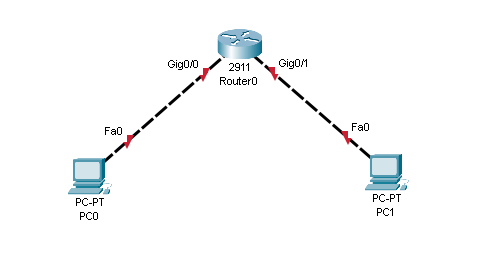

# Getting started - A quick introduction to configuring Cisco routers

## First use

When first booting a new router you'll be prompted to enter the initial configuration dialog.
You can skip it by answering `no` and getting straight to the CLI.

```txt
Would you like to enter the initial configuration dialog? [yes/no]: no
```

## Configuration modes

Cisco devices several configuration modes, each with its own set of privileges and commands (like root on Linux or Administrator on Windows).
You have to be in the correct mode to run a command (you'll get an error, such as `Invalid input detected at ...` if you're not).

### User EXEC mode

This is the default mode when you first log in to a device.
It's the most limited mode and only allows you to run a few commands, such as `show` and `ping`.

```txt
Router>
```

### Privileged EXEC mode

This mode is entered by running the `enable` command.
It allows you to run all commands available on the device.
Most commands are read-only, so in order to change anything you'll need to enter global configuration mode.

```txt
Router> enable
Router#
```

### Global configuration mode

This mode is entered by running the `configure terminal` command.
It allows you to configure the device, like being root on Linux or Administrator on Windows.

```txt
Router# configure terminal
Router(config)#
```

### Sub-configuration modes

These modes are entered by running a command in global configuration mode.
They allow you to configure a specific part of the device, for example an interface.

```txt
Router(config)# interface g0/0
Router(config-if)#
```

## Configuring IP addresses



We'll configure IP addresses on the two interfaces of `Router0`

```txt
Router(config)# interface g0/0
Router(config-if)# ip address 192.168.1.1 255.255.255.0
Router(config-if)# no shutdown
```

Explanation:

- `interface g0/0` - Enter interface configuration mode for interface `g0/0` (we'll be configuring this specific interface)
- `ip address 192.168.1.1 255.255.255.0` - Configure an IP address on the interface. The first parameter is the IP address, the second is the subnet mask.
- `no shutdown` - Turn on the interface (by default all interfaces are turned off). The light on the interface should turn green after running this command.

Note: if you get output such as

```txt
LINK-5-CHANGED: Interface GigabitEthernet0/0, changed state to up
%LINEPROTO-5-UPDOWN: Line protocol on Interface GigabitEthernet0/0, changed state to up
```

after running the `no shutdown` command, it means that the interface is up and running, you can keep going.

The same commands are then used to configure the second interface:

```txt
Router(config)# interface g0/1
Router(config-if)# ip address 192.168.2.1 255.255.255.0
Router(config-if)# no shutdown
```

## Full configuration

```txt
Router> enable
Router# configure terminal

Router(config)# interface g0/0
Router(config-if)# ip address 192.168.1.1 255.255.255.0
Router(config-if)# no shutdown

Router(config)# interface g0/1
Router(config-if)# ip address 192.168.2.1 255.255.255.0
Router(config-if)# no shutdown
```

## Shortening commands

You can shorten commands as long as they're unambiguous.
For example, `interface g0/0` can be shortened to `int g0/0` and `ip address` to `ip addr`.
The most obvious example is interface names: `g0/0` instead of `GigabitEthernet0/0`.

Full configuration with shortened commands:

```txt
Router> en
Router# conf t

Router(config)# int g0/0
Router(config-if)# ip addr 192.168.1.1 255.255.255.0
Router(config-if)# no shut

Router(config)# int g0/1
Router(config-if)# ip addr 192.168.2.1 255.255.255.0
Router(config-if)# no shut
```

## Fixing mistakes

If you make a mistake while configuring a device, you can write `no` before the command to undo it.

```txt
Router(config-if)# no ip address
```
