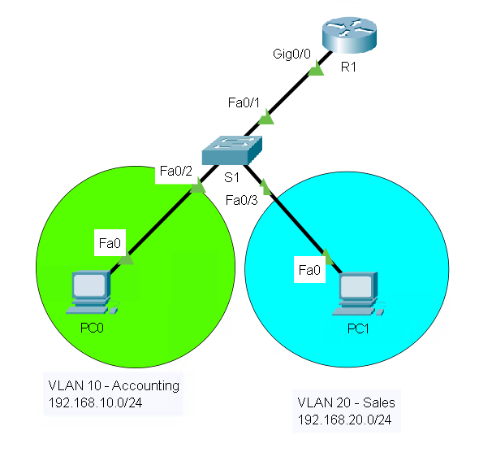
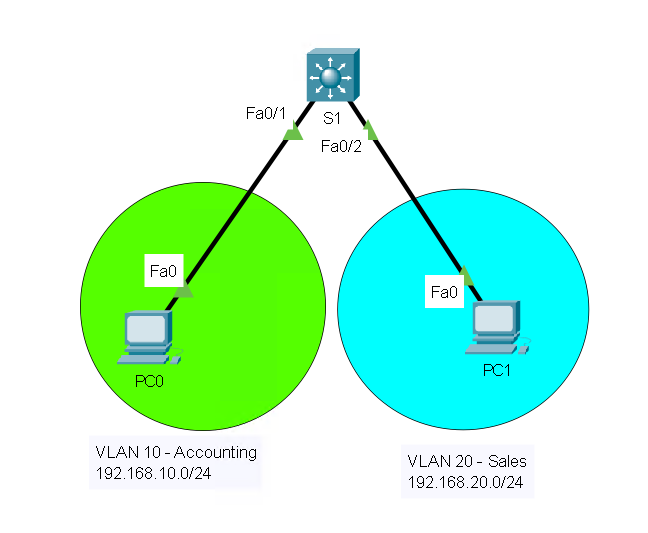

# Inter-VLAN routing

## Router-on-a-stick



Configure VLANs and interfaces on `S1`:

```txt
# Create VLANs
S1(config)# vlan 10
S1(config-vlan)# name Accounting
S1(config)# vlan 20
S1(config-vlan)# name Sales

# Configure trunk on interface fa0/1 (to the router)
S1(config)# interface fa0/1
S1(config-if)# switchport mode trunk
S1(config-if)# switchport trunk allowed vlan 10,20

# Configure access on interfaces fa0/2 and fa0/3 (to the computers)
S1(config)# interface fa0/2
S1(config-if)# switchport mode access
S1(config-if)# switchport access vlan 10

S1(config)# interface fa0/3
S1(config-if)# switchport mode access
S1(config-if)# switchport access vlan 20
```

Configure subinterfaces on `R1`:

```txt
R1(config)# interface g0/0
R1(config-if)# no shutdown      # Enable physical interface

R1(config)# interface g0/0.10
R1(config-subif)# encapsulation dot1q 10
R1(config-subif)# ip address 192.168.10.1 255.255.255.0

R1(config)# interface g0/0.20
R1(config-subif)# encapsulation dot1q 20
R1(config-subif)# ip address 192.168.20.1 255.255.255.0

```

## L3 Switch



Configure `S1`:

```txt

# Enable IP routing
S1(config)# ip routing

# Create VLANs
S1(config)# vlan 10
S1(config-vlan)# name Accounting
S1(config)# vlan 20
S1(config-vlan)# name Sales

# Configure access on interfaces fa0/1 and fa0/2
S1(config)# interface fa0/1
S1(config-if)# switchport mode access
S1(config-if)# switchport access vlan 10

S1(config)# interface fa0/2
S1(config-if)# switchport mode access
S1(config-if)# switchport access vlan 20

# Create VLAN interfaces
S1(config)# interface vlan 10
S1(config-if)# ip address 192.168.10.1 255.255.255.0
S1(config)# interface vlan 20
S1(config-if)# ip address 192.168.20.1 255.255.255.0
```
