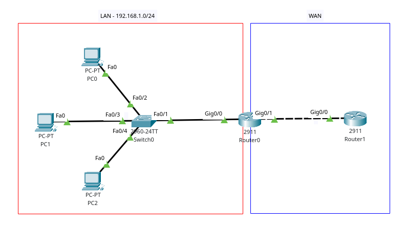

# NAT



All configuration is done on `Router0`

## Static NAT

Mapping between two addresses, such as `192.168.1.2 <---> 200.5.4.2`.

1. Create a mapping between the inside local address (`192.168.1.2`) and the inside global addresses (`200.5.4.2`)

    ```txt
    R(config)# ip nat inside source static 192.168.1.2 200.5.4.2
    ```

2. Configure inside and outside interfaces

    ```txt
    R(config)# interface g0/0
    R(config-if)# ip nat inside

    R(config)# interface g0/1
    R(config-if)# ip nat outside
    ```

## Dynamic NAT

Uses a pool of public IP addresses for mapping private addresses.

1. Create a pool of public addresses to use

    ```txt
    R(config)# ip nat pool <pool name> <first-public-addr> <last-public-addr> netmask <mask>
    ```

    Example:

    ```txt
    R(config)# ip nat pool NAT_POOL 200.5.4.1 200.5.4.14 netmask 255.255.255.240
    ```

2. Create an ACL to define which private addresses should be translated

    ```txt
    R(config)# access-list 1 permit 192.168.1.0 0.255.255.255
    ```

3. Bind pool of public addresses to the ALC for private addresses

    ```txt
    R(config)# ip nat inside source list 1 pool NAT_POOL
    ```

4. Configure inside and outside interfaces

    ```txt
    R(config)# interface g0/0
    R(config-if)# ip nat inside

    R(config)# interface g0/1
    R(config-if)# ip nat outside
    ```

## PAT (port address translation)

Uses ports to avoid having to use multiple public addresses.

### PAT with single IP public IP

Same as static NAT, but we also need to add the keyword **overload**

Full example:

```txt
R(config)# access-list 1 permit 192.168.0.0 0.0.255.255
R(config)# ip nat inside source list 1 interface g0/1 overload

R(config)# interface g0/0
R(config-if)# ip nat inside

R(config)# interface g0/1
R(config-if)# ip nat outside
```

### PAT with a pool of public IPs

Same as dynamic NAT, except step 3, which also needs the keyword **overload**

```txt
R(config)# ip nat inside source list 1 pool NAT_POOL overload
```

Full example:

```txt
R(config)# ip nat pool NAT_POOL 200.5.4.1 200.5.4.14 netmask 255.255.255.240

R(config)# access-list 1 permit 192.168.1.0 0.255.255.255

R(config)# ip nat inside source list 1 pool NAT-POOL overload

R(config)# interface g0/0
R(config-if)# ip nat inside

R(config)# interface g0/1
R(config-if)# ip nat outside
```

## Verify

```txt
R# show ip nat translations
R# show ip nat statistics
```
