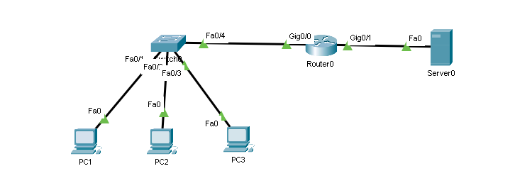

# SLAAC and DHCPv6



## SLAAC

```txt
# Enable IPv6 routing
Router0(config)# ipv6 unicast-routing
```

## Stateless DHCPv6 (SLAAC + DHCPv6 server)

```txt
# Enable IPv6 routing
Router0(config)# ipv6 unicast-routing

Router0(config)# ipv6 dhcp pool POOL_NAME
Router0(config-dhcpv6) dns-server 2001:db8:acad:1::254
Router0(config-dhcpv6) domain-name example.net

Router(config)# interface g0/0
Router(config-if)# ipv6 nd-other-config-flag
Router(config-if)# ipv6 dhcp server POOL_NAME
# Do not forget to set an IP address and to enable the interface
```

## Stateful DHCPv6 (DHCPv6 server only)

```txt
# Enable IPv6 routing
Router0(config)# ipv6 unicast-routing

Router0(config)# ipv6 dhcp pool POOL_NAME
Router0(config-dhcpv6) address prefix 2001:db8:acad:1::/64
Router0(config-dhcpv6) dns-server 2001:db8:acad:1::254
Router0(config-dhcpv6) domain-name example.net

Router(config)# interface g0/0
Router(config-if)# ipv6 nd managed-config-flag
Router(config-if)# ipv6 nd prefix default no-autoconfig
Router(config-if)# ipv6 dhcp server POOL_NAME
# Do not forget to set an IP address and to enable the interface
```

## Verify configuration

```txt
Router0# show ipv6 dhcp pool
Router0# show ipv6 dhcp binding
```

## DHCP client

If you want a router interface to act as a DHCP client.
Let's say `g0/1` on `Router0` will act as a client.

### Stateless

```txt
Router0(config)# ipv6 unicast-routing
Router0(config)# interface g0/1
Router0(config-if)# ipv6 enable     # Creates a link-local address
Router0(config-if)# ipv6 address autoconfig # Create IPv6 address with SLAAC
```

### Stateful

```txt
Router0(config)# ipv6 unicast-routing
Router0(config)# interface g0/1
Router0(config-if)# ipv6 enable     # Creates a link-local address
Router0(config-if)# ipv6 address dhcp # Get IP address from DHCP
```

## Relay agent

```txt
Router0(config)# interface g0/0
Router0(config-if)# ipv6 dhcp relay destination 2001:db8:acad:1:2 
```
