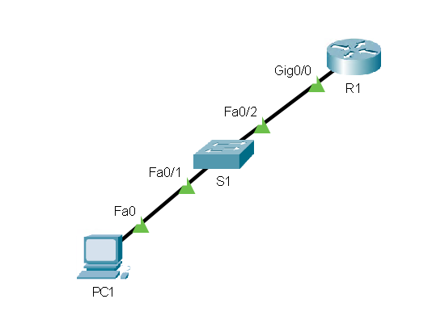

# SSH

On the following network we would like to be able to use SSH to connect to both `S1` and `R1`.
The configuration will be the same, except that on the switch you also need to assign it an IP address via an SVI (VLAN) interface.



## Router

```txt
# Make sure the device has a hostname set (anything but the default)
Router(config)# hostname R1

# You need to set a domain
R1(config)# ip domain-name example.net

# Asks for a key size, larger is safer but also slower (2048 or 4096 are fine)
R1(config)# crypto key generate rsa 

R1(config)# ip ssh version 2

# This selects interfaces 0 to 3, if you have more you might need to use 0 15 or something similar
R1(config)# line vty 0 3    
R1(config-line)# transport input ssh
R1(config-line)# login local

# Username and password for logging in via SSH
R1(config)# username joe secret cisco123
```

## Switch

Configuration is the same as the router, but you also need to assign an IP address to the switch.

```txt
# Make sure the device has a hostname set (anything but the default)
Switch(config)# hostname S1

# Assign an IP address to the switch (VLAN 1 is the default VLAN, you should probably create a separate management VLAN for this instead)
Switch(config)# interface vlan 1
Switch(config-if)# ip address 192.168.1.2 255.255.255.0
Switch(config-if)# no shutdown

# You need to set a domain
S1(config)# ip domain-name example.net

# Asks for a key size, larger is safer but also slower (2048 or 4096 are fine)
S1(config)# crypto key generate rsa

S1(config)# ip ssh version 2

# This selects interfaces 0 to 3, if you have more you might need to use 0 15 or something similar
S1(config)# line vty 0 3
S1(config-line)# transport input ssh
S1(config-line)# login local

# Username and password for logging in via SSH
S1(config)# username joe secret cisco123
```

## Notes

- `login local` - device will use a local username and password for authentication.
- `login` - device will use the line password for authentication. Configured like this:

    ```txt
    R1(config)# line vty 0 3
    R1(config-line)# transport input ssh
    R1(config-line)# password cisco123
    R1(config-line)# login
    ```
