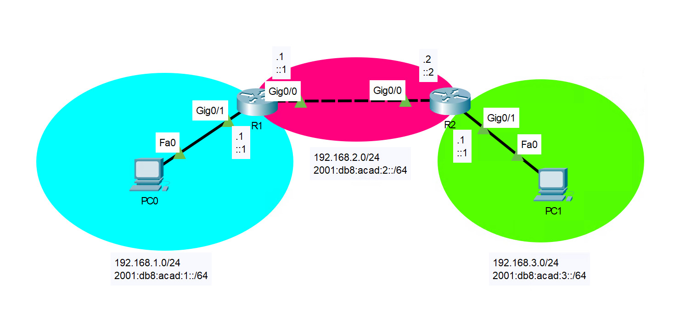

# Static routing



## Static route

Tell `R1` where to forward packets for `192.168.3.0/24` and `2001:db8:acad:3::/64` (it is symmetrical for `R2`):

```txt
R1(config)# ipv6 unicast-routing        # For IPv6 you also need this

R1(config)# ip route 192.168.3.0 255.255.255.0 192.168.2.2
R1(config)# ipv6 route 2001:db8:acad:3::/64 2001:db8:acad:2::2
```

## Default route

Since the only way for `R1` to reach other networks is through `R2`, we can tell it to send everything to `R2`:

```txt
R1(config)# ipv6 unicast-routing        # For IPv6 you also need this

R1(config)# ip route 0.0.0.0 0.0.0.0 192.168.2.2
R1(config)# ipv6 route ::/0 2001:db8:acad:2::2
```

## Floating static route

If you want to have a backup route in case the primary route fails, you can add a floating static route.
This is a route with a higher administrative distance than the primary route, meaning it will only be used if the primary route fails.
The topology above is not very good for this.

```txt
R1(config)# ipv6 unicast-routing        # For IPv6 you also need this

R1(config)# ip route 192.168.3.0 255.255.255.0 192.168.2.2 10
R1(config)# ipv6 route 2001:db8:acad:3::/64 2001:db8:acad:2::2 10
```

## Verify

```txt
R1# show ip route
R1# show ipv6 route
```

Try pinging from `PC0` to `PC1`
